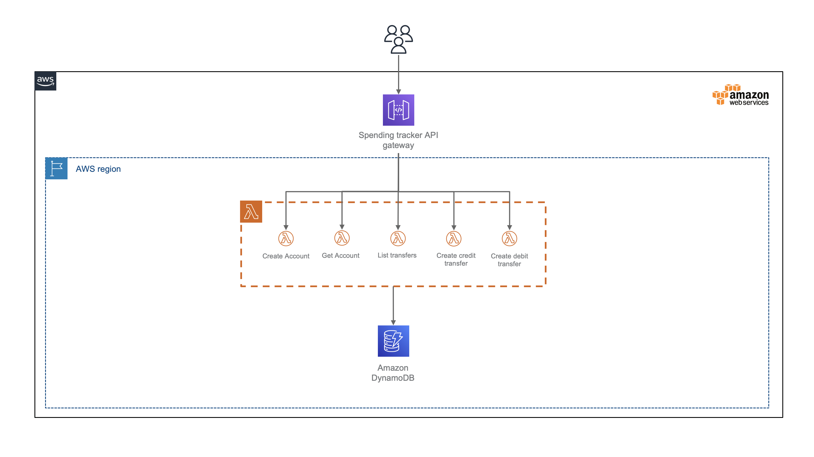

# Spending Tracker

A simple spending tracker, using Serverless, Node, TypeScript, Lerna and DynamoDB.

## Prerequisites

- Node >= `14.17.0` was used to create this demo, although it may work in earlier versions, it has not been tested.
- Docker

## Architecture

A visual representation of the solution:

## API documentation

The API is documented using the OpenAPI specification. To view/edit the docs, copy the contents of the [spending-tracker-service.yaml](./docs/spending-tracker-service.yml) into the [Swagger Editor](https://editor.swagger.io/)

There is also a [postman collection](./docs/spending-tracker.postman_collection-.json) available.

## Installation

Clone the repo and run `npm i` in your terminal from the root directory.

## Running locally

### Run the environment
Run `npm run environment` in your terminal to start localstack, only used for DynamoDB in this example. It can take a few minutes to pull the localstack image from the Docker repository on first run.

> Docker must be installed and running

### Deploy the API locally
Ensure the environment is running in docker and type `npm run deploy:local` in your terminal to deploy the API cloudformation to localstack.

### Run the API and Client
Run `npm run start` in your terminal to start the API and client.

> Ensure the environment is running and deployed by following the steps above

## Unit tests
To run all of the tests in the monorepo run `npm run test` from the root dir.

Alternatively you can cd into the relevant project and type `npm run test` in your terminal to run the unit tests

## Deploy the API to AWS

Run `npm run deploy` to provision / update the API in AWS

## Technical Questions

- Did you have time to complete the coding test?

    Yeah, did a few hours in my spare time for a few days

- What would you add (or change) to your solution if you had more time, or needed to productionalize it?

    - Add monitoring and alerting to the solution
    - Add authentication and authorisation using lambda authorisers
    - Additional validation checking
    - Load test the application
    - Remove hard coded account number
    - Add rate limiting
    - Integration test the service layers (account-service.ts and transfers-service.ts)

- How would you optimise your solution?

    - I've optimised the bundle with webpack
    - Depending on load add a queue for the DB write operations

- What are the performance implications of your solution?
    - DB writes are not running off the back of a queue with could lead to a bottleneck depending on application load
    - Lambda functions can have cold starts

- How would it scale with a growing user base?
    - Because I've chose to use Lambda and DynamoDB it will scale well, it still might require further optimisation (see above)

- What would you change to ensure it could keep growing?
    - See above

- What are the security issues you can see in your solution?
    - No rate limiting
    - No auth
    - Loose request validation

- How does your solution handle concurrency in order to maintain correct ordering of transfers.
    - DynamoDB Transactions
    - Idempotency keys

- List a few of your preferred JavaScript frameworks (also let us know in which situations you would choose to use/not use them).
    - serverless - great to manage a large Serverless project
    - lerna - great to manage repos of large teams with microservices
    - uuid - to generate v4 and v5 uuids
    - axios - nice API for HTTP requests in node
    - ajv - JSON schema validator, helpful for validating requests
    - validator - solid validator for common requirements
    - winston - good logging framework
    - storybook - good for prototyping UI and building a design system
    - prettier - consistent formatting of code
    - eslint
    - husky - validation pre-commit
    - jsonwebtoken - JWT signing and decoding

    Probably a lot more I'm forgetting...

- How would you change this test, if at all?

    Nothing I would change, the test was enjoyable
